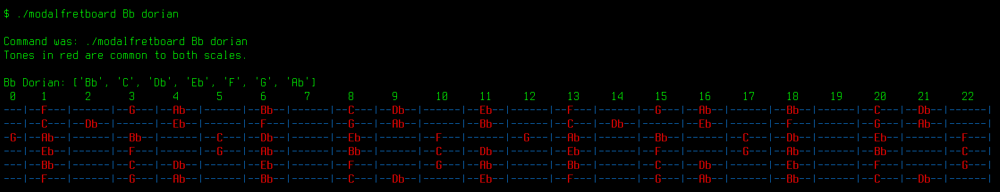
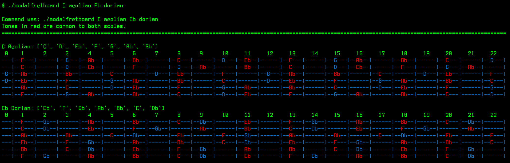
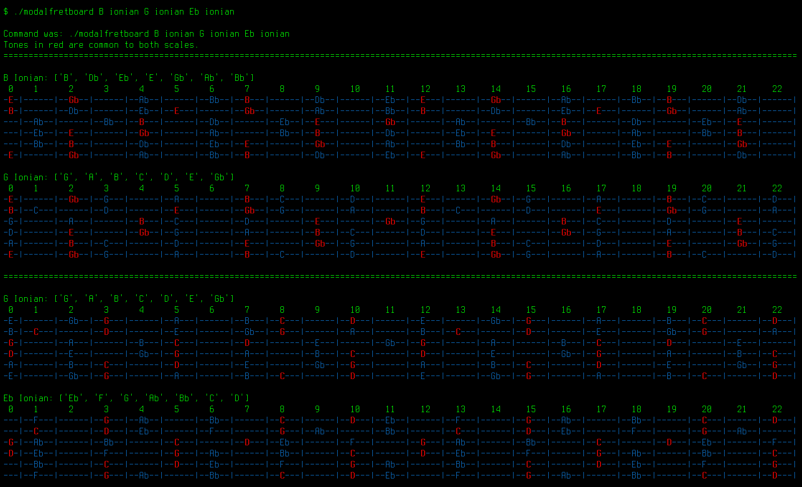

# Modal Fretboard

A trivial application to compare two scales on the guitar fretboard.

## Requirements

* Linux
* https://github.com/ku1ik/stderred (to display common scale tones in red)
* Python 3.11

## Usage

```
$ ./main.py

Usage:
        ./main.py [TONE1 MODE1 TONE2 MODE2]

Example:
        ./main.py C aeolian Eb dorian # Which is the Blue Bossa modulation

All tones should be expressed in uppercase with flats (e.g. _Eb_ instead of _D#_).

Available modes are: ionian, dorian, phrygian, lydian, mixolydian, aeolian, locrian
```
## Examples

### Bb Dorian scale

This is not a modulation, just showing up the Bb Dorian scale



### Blue Bossa

Blue Bossa seems a minor third upwards modulation, but it is not, it is a tone downwards modulation.



### Giant Steps

One of the most complex chord progressions.


